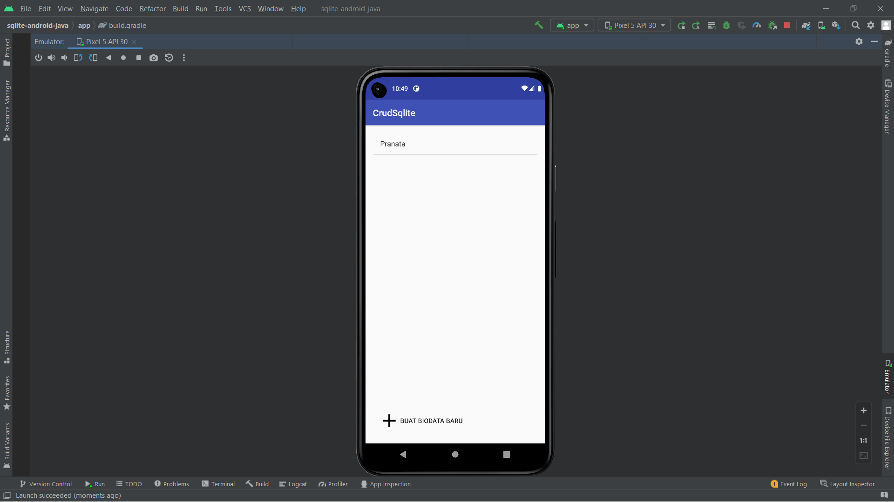
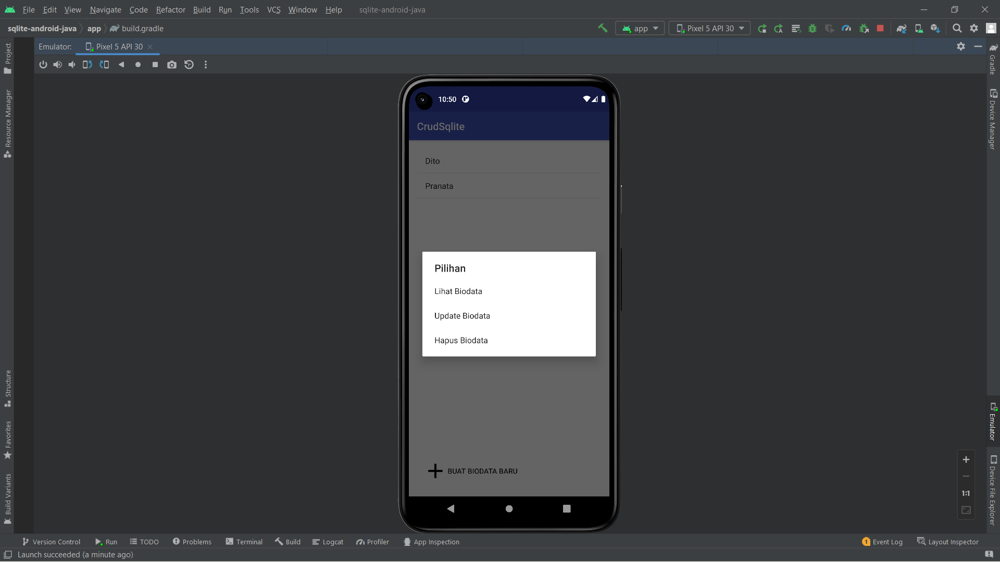
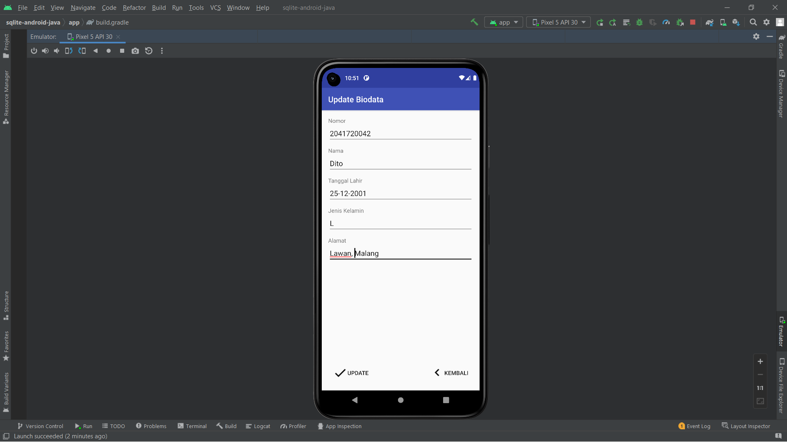

## Nama      : Pranata Dito Fitriyansyah
## Kelas     : TI - 3C
## No. Absen : 18

Tugas : Mengerjakan CRUDSqLite menggunakan android studio

Tampilan Awal

Tambah Data Baru

Berhasil Tambah Data

Pilihan Lihat, Update dan Delete Data

Lihat Data

Update Data

Delete Data 

